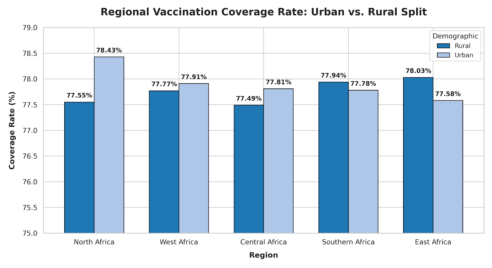

# Vaccination Coverage Analysis Across Africa (2021–2023)

## Introduction

Vaccination remains one of the most effective public health interventions for reducing childhood mortality and preventing the spread of infectious diseases. This project explores vaccination coverage trends across African countries and regions between **2021** and **2023** using a synthetic dataset inspired by World Health Organization (WHO) reporting structures.

The objective was to identify regional performance patterns, country-level leaders and laggards, vaccination growth trends, healthcare workforce efficiency, and demographic differences in vaccine distribution through advanced SQL analysis.

---

## Background

The inspiration for this project came from a clinical posting at Nnamdi Azikiwe University Teaching Hospital during my training as a Medical Laboratory Science student.

During the posting, I observed large numbers of mothers waiting in long queues to vaccinate their children. This experience sparked my curiosity about vaccination coverage beyond my local environment and motivated me to investigate immunization trends across Africa.

Finding reliable continental vaccination data proved challenging. After extensive searching, I discovered a synthetic dataset on Kaggle designed around WHO vaccination reporting standards. While synthetic, the dataset provided a realistic framework for analyzing vaccination trends, workforce deployment, and regional healthcare performance across African countries.

---

## Project Objectives

This project sought to answer the following questions:

* Which African regions achieved the highest vaccination coverage?
* Which countries were the strongest and weakest performers?
* How did vaccination campaigns change year-over-year?
* What relationship exists between healthcare workforce size and vaccination outcomes?
* How do urban and rural vaccination programs compare?
* Which diseases received the highest vaccination attention?

---

## Tools Used

* MySQL
* GitHub
* Advanced SQL
* Window Functions
* CTEs (Common Table Expressions)
* Aggregate Functions
* Ranking Functions
* Subqueries
* Data Analysis & Reporting

---

## Dataset Information

**Source:** Kaggle Synthetic Dataset

**Dataset Characteristics:**

* WHO-inspired vaccination reporting structure
* Covers African countries and regions
* Includes vaccination targets, administered vaccines, workforce metrics, disease categories, and demographic classifications
* Time period: 2021–2023

---

# Key Findings

### 1. North Africa Recorded the Highest Regional Vaccination Coverage

North Africa consistently ranked among the best-performing regions, achieving approximately 78% coverage despite operating with one of the smallest healthcare workforces.

---

### 2. East and West Africa Managed the Largest Vaccination Volumes

Both regions administered between 35 million and 40 million vaccinations annually, demonstrating strong operational capacity despite significantly larger target populations.

---

### 3. Polio Remained Africa's Most Administered Vaccine

Polio vaccines ranked first across all years analyzed, with vaccination volumes nearly double those of the second-ranked disease category.

---

### 4. Workforce Size Alone Did Not Guarantee Better Outcomes

Several countries achieved superior vaccination coverage despite having fewer healthcare workers than lower-performing counterparts, highlighting the importance of healthcare delivery efficiency.

---

# SQL Analysis

Below are some of the SQL queries used in this project.

###  Yearly Regional Vaccination Coverage Ranking

```sql
SELECT *
FROM (
SELECT 
   Region,
   YEAR(vaccination_date) Year,
   SUM(target_population) TotalTargeted,
   SUM(vaccinations_administered) TotalVaccinated,
   SUM(target_population) - SUM(vaccinations_administered) TotalUnvaccinated,
   ROUND((SUM(vaccinations_administered)/SUM(target_population))*100,2) CoverageRate,
   DENSE_RANK() OVER(PARTITION BY YEAR(vaccination_date) 
   ORDER BY (SUM(vaccinations_administered)/SUM(target_population))*100 DESC) Ranking
FROM vaccination_data1
GROUP BY Year, Region) AS X
WHERE Ranking <= 5;
```

**Result Output**

| Region          | Year | TotalTargeted | TotalVaccinated | TotalUnvaccinated | CoverageRate   | Ranking |
| --------------- | ---- | -------------: | ---------------: | -----------------: | ----------------: | ------: |
| North Africa    | 2021 |     16,819,050 |       13,131,563 |          3,687,487 |             78.08 |       1 |
| Southern Africa | 2021 |     16,783,402 |       13,102,831 |          3,680,571 |             78.07 |       2 |
| East Africa     | 2021 |     50,911,276 |       39,654,985 |         11,256,291 |             77.89 |       3 |
| West Africa     | 2021 |     46,589,269 |       36,287,508 |         10,301,761 |             77.89 |       4 |
| Central Africa  | 2021 |     23,217,915 |       18,023,651 |          5,194,264 |             77.63 |       5 |
| North Africa    | 2022 |     17,229,278 |       13,414,844 |          3,814,434 |             77.86 |       1 |
| West Africa     | 2022 |     45,886,311 |       35,704,002 |         10,182,309 |             77.81 |       2 |
| East Africa     | 2022 |     52,004,820 |       40,449,544 |         11,555,276 |             77.78 |       3 |
| Central Africa  | 2022 |     21,979,357 |       17,076,149 |          4,903,208 |             77.69 |       4 |
| Southern Africa | 2022 |     17,548,731 |       13,608,835 |          3,939,896 |             77.55 |       5 |
| North Africa    | 2023 |     17,364,447 |       13,551,575 |          3,812,872 |             78.04 |       1 |
| Southern Africa | 2023 |     17,450,577 |       13,605,626 |          3,844,951 |             77.97 |       2 |
| West Africa     | 2023 |     45,516,301 |       35,420,110 |         10,096,191 |             77.82 |       3 |
| East Africa     | 2023 |     50,096,176 |       38,943,084 |         11,153,092 |             77.74 |       4 |
| Central Africa  | 2023 |     22,517,743 |       17,479,077 |          5,038,666 |             77.62 |       5 |


### Top Performing Countries

```sql
SELECT *
FROM (
SELECT 
   Country,
   SUM(target_population) TotalTargeted,
   SUM(vaccinations_administered) Totalvaccinated,
   SUM(target_population) - SUM(vaccinations_administered) TotalVnvaccinated,
   ROUND((SUM(vaccinations_administered)/SUM(target_population))*100,2) CoverageRate,
   DENSE_RANK() OVER(ORDER BY (SUM(vaccinations_administered)/SUM(target_population))*100 DESC) Ranking
FROM vaccination_data1
GROUP BY Country) AS X
WHERE ranking < 11 ;
```

**Result Output**

| Country    | TotalTargeted | TotalVaccinated | TotalUnvaccinated | CoverageRate    | Ranking |
| ---------- | -------------: | ---------------: | -----------------: | ----------------: | ------: |
| Cabo Verde |      8,554,709 |        6,748,147 |          1,806,562 |             78.88 |       1 |
| Mauritius  |      8,718,174 |        6,852,363 |          1,865,811 |             78.60 |       2 |
| Algeria    |      8,724,836 |        6,845,819 |          1,879,017 |             78.46 |       3 |
| Eswatini   |      8,625,416 |        6,762,395 |          1,863,021 |             78.40 |       4 |
| Burundi    |      8,193,611 |        6,421,319 |          1,772,292 |             78.37 |       5 |
| Angola     |      8,633,656 |        6,765,214 |          1,868,442 |             78.36 |       6 |
| Morocco    |      8,612,576 |        6,744,639 |          1,867,937 |             78.31 |       7 |
| Seychelles |      8,294,560 |        6,494,751 |          1,799,809 |             78.30 |       8 |
| Gambia     |      9,171,071 |        7,178,522 |          1,992,549 |             78.27 |       9 |
| Liberia    |      8,203,904 |        6,419,374 |          1,784,530 |             78.25 |      10 |


### Year-over-Year Vaccination Growth By Countries

```sql
WITH yearly_vaccinations AS (
SELECT
   country Country,
   YEAR(vaccination_date) Year,
   SUM(vaccinations_administered) TotalVaccinations
FROM vaccination_data1
GROUP BY Country,year),
yearly_vaccinations2 AS (
SELECT *, 
   LAG(TotalVaccinations) 
   OVER (PARTITION BY Country ORDER BY year) PreviousYearVaccinations,
   ROUND(((TotalVaccinations-LAG(TotalVaccinations) 
   OVER (PARTITION BY Country ORDER BY year))/LAG(TotalVaccinations) 
   OVER (PARTITION BY Country ORDER BY year))*100,2) AS YoYGrowthPercent
FROM yearly_vaccinations),
yearly_vaccinations3 AS (
SELECT *,
    DENSE_RANK() OVER(PARTITION BY year ORDER BY YoYGrowthPercent DESC) Ranking
FROM yearly_vaccinations2
WHERE YoYGrowthPercent IS NOT NULL) 
SELECT *
FROM yearly_vaccinations3
WHERE ranking <= 10;
```

**Result Output**

| Country                  | Year | TotalVaccinations | PreviousYearVaccinations | YoYGrowthPercent | Ranking |
| ------------------------ | ---- | -----------------: | -------------------------: | -----------: | ------: |
| Algeria                  | 2022 |          2,468,323 |                  1,979,818 |        24.67 |       1 |
| Seychelles               | 2022 |          2,357,561 |                  1,937,721 |        21.67 |       2 |
| Mauritius                | 2022 |          2,584,880 |                  2,153,083 |        20.05 |       3 |
| Ethiopia                 | 2022 |          2,331,300 |                  1,972,055 |        18.22 |       4 |
| Sudan                    | 2022 |          2,162,404 |                  1,874,844 |        15.34 |       5 |
| Uganda                   | 2022 |          2,364,869 |                  2,067,690 |        14.37 |       6 |
| Namibia                  | 2022 |          2,361,060 |                  2,093,619 |        12.77 |       7 |
| Rwanda                   | 2022 |          2,442,677 |                  2,166,817 |        12.73 |       8 |
| Gabon                    | 2022 |          2,373,488 |                  2,175,716 |         9.09 |       9 |
| Gambia                   | 2022 |          2,440,616 |                  2,245,833 |         8.67 |      10 |
| Somalia                  | 2023 |          2,493,516 |                  2,149,958 |        15.98 |       1 |
| Cabo Verde               | 2023 |          2,470,569 |                  2,175,055 |        13.59 |       2 |
| Sudan                    | 2023 |          2,411,946 |                  2,162,404 |        11.54 |       3 |
| Central African Republic | 2023 |          2,210,629 |                  2,014,360 |         9.74 |       4 |
| Angola                   | 2023 |          2,346,366 |                  2,149,237 |         9.17 |       5 |
| Senegal                  | 2023 |          2,448,191 |                  2,272,027 |         7.75 |       6 |
| São Tomé and Príncipe    | 2023 |          2,256,310 |                  2,102,333 |         7.32 |       7 |
| Lesotho                  | 2023 |          2,465,711 |                  2,302,278 |         7.10 |       8 |
| Kenya                    | 2023 |          2,359,361 |                  2,225,656 |         6.01 |       9 |
| Burundi                  | 2023 |          2,079,280 |                  1,965,404 |         5.79 |      10 |


### Urban vs Rural Vaccination Analysis

```sql
SELECT 
     Region,
     Workers,
     urban_rural,
     ROUND((TotalVaccination/TargetVaccination)*100,2) CoverageRate
FROM (
SELECT 
	 Region,
     urban_rural,
     SUM(healthcare_workers) Workers,
     SUM(vaccinations_administered) TotalVaccination,
     SUM(target_population) TargetVaccination
FROM vaccination_data1
GROUP BY 
     Region,
     urban_rural
) AS X
ORDER BY 
     ROUND((TotalVaccination/TargetVaccination)*100,2) DESC
```


---

## What I Learnt

This project strengthened my understanding of both healthcare analytics and advanced SQL.

### Technical Skills

* Writing complex SQL queries
* Window functions and ranking analysis
* Multi-table aggregations
* Trend analysis
* Data storytelling
* Performance optimization

### Domain Knowledge

* Vaccination coverage assessment
* Healthcare workforce analysis
* Regional public health comparisons
* Demographic healthcare disparities
* Public health reporting frameworks

---

## Conclusion

This project demonstrates how SQL can be leveraged to transform raw healthcare data into actionable public health insights.

Through the analysis of vaccination trends across Africa, I identified regional strengths, country-level disparities, growth opportunities, and demographic patterns that influence vaccination outcomes. While the dataset is synthetic, its WHO-inspired structure provides a realistic environment for exploring healthcare analytics challenges.

This project also reflects my ability to combine my Medical Laboratory Science background with data analytics to investigate healthcare problems using evidence-based approaches and advanced SQL techniques.

---

## Project 
[View Project](https://github.com/Osi-Chidera-John/Pan-African-Vaccination-Coverage-Analysis-Using-SQL-2021-2023-/tree/main/Sql_files)

---

## Author

**John Chidera Jr.**

Healthcare Data Analyst

Focused on Healthcare Analytics, SQL, Data Visualization, and Evidence-Based Public Health Research.

Linkedln Profile: [View Profile](https://www.linkedin.com/in/john-chidera-jr-0b6b55319/)

Email: chiderajohn519@gmail.com

